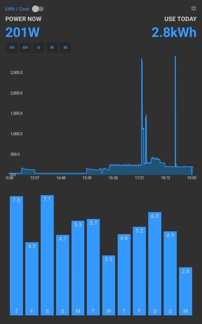

#Emoncms dashboard viewer for Android

View MyElectric Emoncms dashboards from [http://emoncms.org](http://emoncms.org) or any other Emoncms server.

Emoncms is an open-source web application for processing, logging and visualising energy, temperature and other environmental data and is part of the [OpenEnergyMonitor](http://openenergymonitor.org) project.

OpenEnergyMonitor is a project to develop open-source energy monitoring tools to help us relate to our
use of energy, our energy systems and the challenge of sustainable energy.

For support or to get involved with development please post on the forum thread: [http://openenergymonitor.org/emon/node/11260](http://openenergymonitor.org/emon/node/11260)
